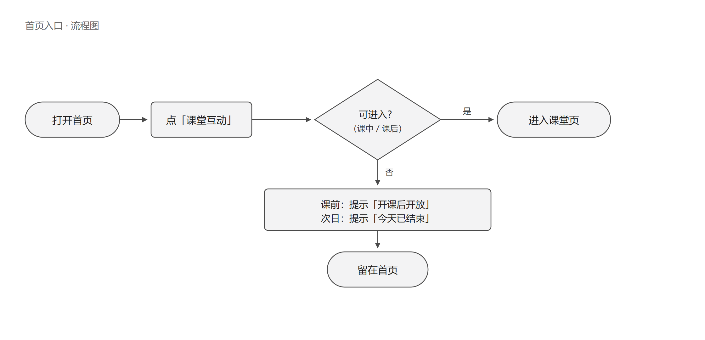
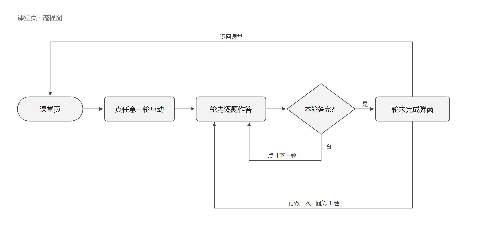
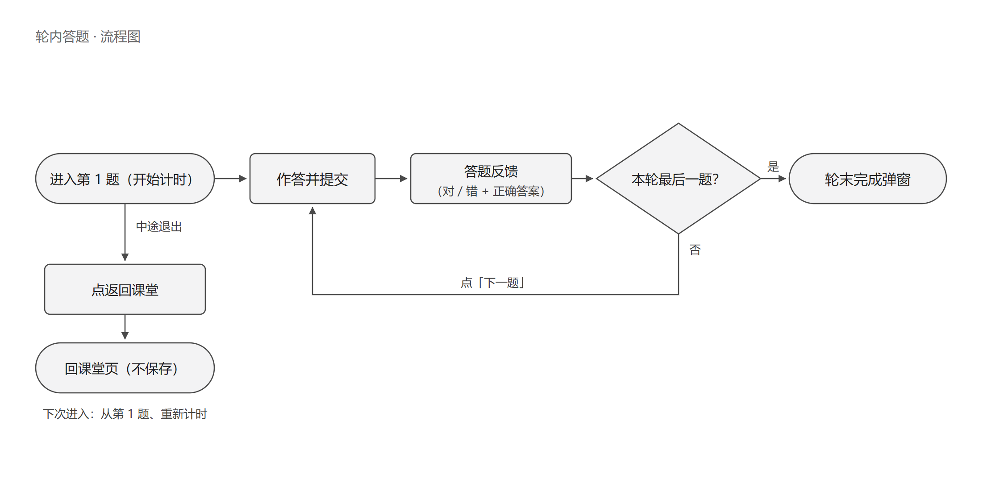
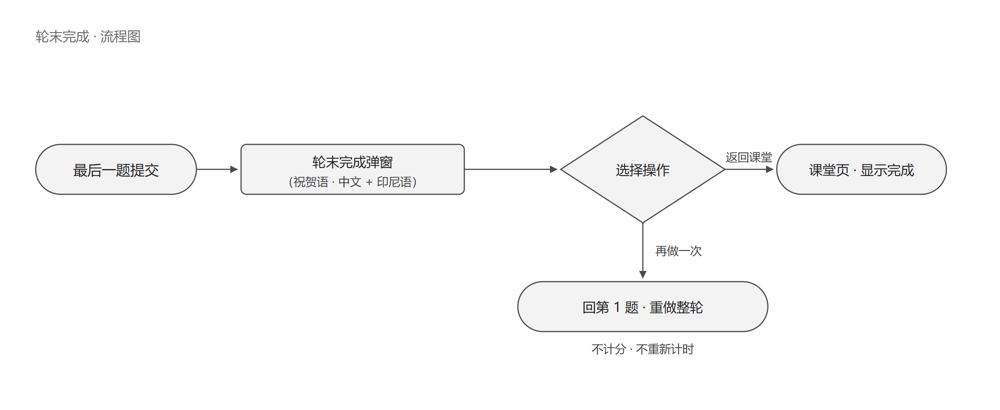

# AI Chinese · 课堂互动 PRD（学生端）

> 对应原型：首页（index.html）+ 课堂页（classroom.html）+ 18 个课堂互动题型页 ｜ 版本：v0.8 · 2026-09-24
> 评审节点：9/29–9/30 ｜ 术语：**轮次**＝课堂上的一轮互动（课堂页一张卡片）；**题目**＝轮内的一道题；**阶段**＝课节的课前 / 课中 / 课后 / 次日。系统内不再使用「关卡 / 关」
> 阅读提示：【本次调整】＝相对旧版（一张卡一道题、完成自动解锁）的变化点；原型图为截图位，UI 定稿后统一补齐

---

## 1｜首页入口：课堂互动

| 6 件套 | 内容 |
| --- | --- |
| 功能点名称 | 首页入口：课堂互动 |
| 功能描述 | 首页「常用功能」里的「课堂互动」磁贴，是学生进入课堂互动的入口；按本节课的阶段开放——课前不可进、课中开放、课后可回看与重做、次日关闭。 |
| 主流程 | 首页 → 点「课堂互动」 → 判断课节阶段 → 可进入：进课堂页；不可进入：屏幕提示，留在首页。 |
| 规则 | ① 阶段由课节时间驱动，磁贴角标同步显示：未开始 / 课中 / 可回看 / 已结束；② 课前（未开始）：不可进入，点按提示「课堂互动将在今天 10:00 开课后开放」（时间按课节配置）；③ 课中：可进入（正常答题，节奏由老师口头控制）；④ 课后（当天 23:59 前）：可进入，课上没做完的可以继续完成、已完成的轮次可以重做；⑤ 次日（已结束）：不可进入，点按提示「今天的课堂互动已经结束」；⑥ 兜底：在课堂页内跨过时间点（如停留到次日）时，点轮次卡片同样给提示、不进入。 |
| 原型图 | 【首页 · 课前】｜【首页 · 课中】｜【首页 · 课后】｜【首页 · 次日】 |
| 流程图 |  |

---

## 2｜课堂页（轮次列表）

| 6 件套 | 内容 |
| --- | --- |
| 功能点名称 | 课堂页（轮次列表） |
| 功能描述 | 学生进入课堂后的主页。顶部展示课次（LESSON N + 课节名）与学习数据（星星、得分、名次）；主体是本节课的互动轮次列表，点任意一轮进入答题，完成后回到本页查看该轮结果。 |
| 主流程 | 进入课堂 → 看到本节课全部轮次卡片（默认全部可点）→ 按老师口令点开某一轮 → 轮内答题 → 答完整轮回到本页 → 该轮显示完成状态。 |
| 规则 | ① 【本次调整】一张卡片 = 一轮互动（1~N 道题，题型可混），卡片标题写轮次主题（中文 + 印尼语），不写题型名；② 【本次调整】所有轮次默认开放：无锁定状态、无锁定图标、无「解锁下一轮」提示，课堂节奏由老师口头指令控制，系统不做发放 / 解锁；③ 点击卡片即进入该轮第 1 题，同时开始整轮计时（口径见功能点 5），无二次确认；④ 已完成的轮次点击进入 = 重做整轮，重做不重复计分（见功能点 4）；⑤ 卡片元素：轮次序号、主题（双语）、同班完成人数（x / 40）、完成状态（完成标记、星星、该轮得分）；⑥ 本节课全部轮次完成后，本页出「全部完成」弹窗（沿用现有样式）；⑦ 星星、得分、速度榜的口径统一见功能点 5。 |
| 原型图 | 【课堂页 · 初始】｜【课堂页 · 一轮已完成】｜【全部完成弹窗】｜【速度榜】 |
| 流程图 |  |

---

## 3｜轮内答题

| 6 件套 | 内容 |
| --- | --- |
| 功能点名称 | 轮内答题 |
| 功能描述 | 一轮互动内部的连续答题流程。学生逐题作答，每题提交后看到答题反馈（对 / 错 + 正确答案）；非最后一题点「下一题」继续，答完最后一题进入轮末完成弹窗。一轮可包含 1~N 道题，题型可混。 |
| 主流程 | 进入该轮第 1 题 → 作答 → 提交 → 答题反馈 → 点「下一题」→ 第 2 题 → …… → 第 N 题 → 提交 → 轮末完成弹窗（功能点 4）。 |
| 规则 | ① 【本次调整】轮内连续答题、不返回课堂页，只有答完整轮才回课堂；② 非最后一题：提交后按钮变为「下一题（Lanjut）」，手动点击继续（不自动跳转）；③ 最后一题：提交后按钮变为「已提交（Terkirim）」不可再点，短暂停顿后进入轮末完成弹窗；④ 【本次调整】单题轮（一轮只有一道题）：提交后直接进入轮末完成弹窗，没有「下一题」环节；⑤ 题目进度：多题轮显示「第 x / N 题」；⑥ 判定类题型每题只判一次、不提供单题重做，想重做走整轮「再做一次」（功能点 4）；⑦ 语音类题型（跟读模仿 / 看图说话 / 开放问答）：作答与重试口径见「附 · 题型清单」备注；⑧ 课堂投票：无对错，照常参与轮内流程，不影响本轮计分；⑨ 中途退出不保存进度：下次进入从第 1 题重新开始，整轮重新计时。 |
| 原型图 | 【轮内第 1 题】｜【答题反馈 · 正确】｜【答题反馈 · 错误】｜【最后一题 · 已提交】 |
| 流程图 |  |

---

## 4｜轮末完成与「再做一次」

| 6 件套 | 内容 |
| --- | --- |
| 功能点名称 | 轮末完成与「再做一次」 |
| 功能描述 | 一轮全部题目答完后出现的整轮完成弹窗：展示完成祝贺（中文 + 印尼语），提供「返回课堂」「再做一次」两个操作。 |
| 主流程 | 最后一题提交 → 轮末完成弹窗 → 返回课堂（回轮次列表）｜再做一次（回第 1 题、整轮重做）。 |
| 规则 | ① 【本次调整】弹窗代表「整轮完成」（旧版为单题完成），视觉与文案沿用现有「太棒啦」样式；② 【本次调整】「再做一次」＝重做整轮（从第 1 题开始），不是只重做最后一题；③ 完成一轮固定 +5 分 + 1 颗星：不看本轮题数、不看对错（2026-09-24 定）；④ 重做不重复计分、不重复点亮星星、不计入速度榜；且不重新计时（速度榜用时保持第一次）；⑤ 弹窗展示：祝贺语 + 两个操作；不含得分 / 星星 / 用时信息；⑥ 「返回课堂」后该轮显示完成状态（星星 + 得分），仍可再次进入。 |
| 原型图 | 【轮末完成弹窗】 |
| 流程图 |  |

---

## 5｜计分、星星与速度榜

| 6 件套 | 内容 |
| --- | --- |
| 功能点名称 | 计分、星星与速度榜 |
| 功能描述 | 课堂互动的三项数据反馈。星星与得分按「轮」结算；速度榜按「轮」排名，展示每轮谁最快。 |
| 主流程 | 完成一轮 → 结算（+5 分、+1 颗星、记录本轮用时）→ 课堂页更新星星、总分与名次；速度榜更新本轮排名。 |
| 规则 | ① 星星：一轮完成得 1 颗，重做不重复点亮，课堂页星星数 = 已完成轮数；② 得分：一轮完成 +5 分，不看题数、不看对错；课堂总分 = 各轮求和（满分 = 轮数 × 5，如 3 轮满分 15 分）；③ 得分排名：沿用现有「x / 40 · y 分」展示，未完成时显示「等你上榜」；④ 速度榜：按轮统计，展示姓名 + 该轮用时，口径为整轮总用时（进入该轮第 1 题 → 最后一题提交）；⑤ 速度榜只取第一次完成的用时，重做不覆盖、不计入；⑥ 课堂投票不影响口径：含投票的轮次照样 +5 分 + 1 颗星。 |
| 原型图 | 【课堂页 · 星星与得分排名】｜【速度榜】 |
| 流程图 | —（纯规则、无分支，不单独画图） |

---

## 附｜题型清单（18 种）

> 用途：研发 / UI 索引；各题型「作答完成」的细节口径以对应页面为准。

| # | 题型 | 页面 | 备注 |
|---|---|---|---|
| 1 | 快速选择 | interaction-choice.html | |
| 2 | 看图单选 | interaction-picture.html | |
| 3 | 连线配对 | match.html | |
| 4 | 听音选词 | interaction-listening.html | |
| 5 | 补全句子 | interaction-fill.html | |
| 6 | 句子排序 | interaction-order.html | |
| 7 | 课堂投票 | interaction-poll.html | 无对错；照常参与轮内流程 |
| 8 | 记忆翻牌 | memory.html | |
| 9 | 图片—词语连线 | interaction-picture-match.html | |
| 10 | 情景选择 | interaction-situation.html | |
| 11 | 对话补全 | interaction-dialogue.html | |
| 12 | 拼音—汉字—含义匹配 | interaction-pinyin-match.html | |
| 13 | 分类归组 | interaction-category.html | |
| 14 | 拼字 / 组词 | interaction-word-build.html | |
| 15 | 找错改错 | interaction-correction.html | |
| 16 | 跟读模仿 | interaction-read-aloud.html | 语音题；可重读，评分口径以页面为准 |
| 17 | 看图说话 | interaction-picture-talk.html | 语音题；无对错 |
| 18 | 开放问答 | interaction-open-qa.html | 语音题；无对错 |
