# AI Chinese · 课堂互动 PRD（学生端）

> 对应原型：首页（index.html）+ 课堂页（classroom.html）+ 18 个课堂互动题型页 ｜ 版本：v1.0 · 2026-09-28（勘误更新：2026-09-29）
> 评审节点：9/29–9/30 ｜ 术语：**轮次**＝课堂上的一轮互动（课堂页一张卡片）；**题目**＝轮内的一道题；**阶段**＝课节的课前 / 课中 / 课后 / 次日。系统内不再使用「关卡 / 关」
> 阅读提示：原型图为当前原型实拍（UI 更新后同步替换）

| 序号 | 内容 |
| --- | --- |
| 1 | **功能点名称**：首页入口：课堂互动 **功能描述**：首页「常用功能」里的「课堂互动」磁贴，是学生进入课堂互动的入口；按本节课的阶段开放——课前不可进、课中开放、课后可回看与重做、次日关闭。 **主流程**：首页 → 点「课堂互动」 → 判断课节阶段 → 可进入：进课堂页；不可进入：屏幕提示，留在首页。 **规则**： • 阶段由课节时间驱动，磁贴角标同步显示：未开始 / 课中 / 可回看 / 已结束； • 课前（未开始）：不可进入，点按提示「课堂互动将在今天 10:00 开课后开放」（时间按课节配置）； • 课中：可进入（正常答题，节奏由老师口头控制）； • 课后（当天 23:59 前）：可进入，课上没做完的可以继续完成、已完成的轮次可以重做； • 次日（已结束）：不可进入，点按提示「今天的课堂互动已经结束」； • 兜底：在课堂页内跨过时间点（如停留到次日）时，点轮次卡片同样给提示、不进入。 **原型图**： 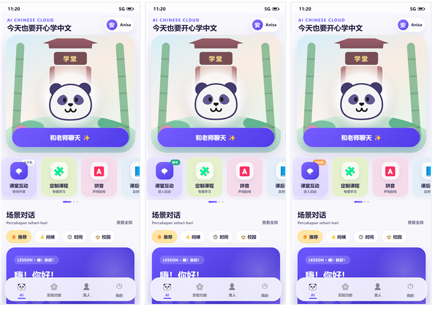 【首页 · 课前】｜【首页 · 课中】｜【首页 · 课后】 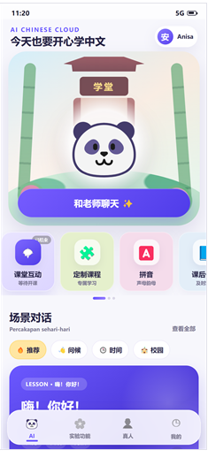 【首页 · 次日】 **流程图**： 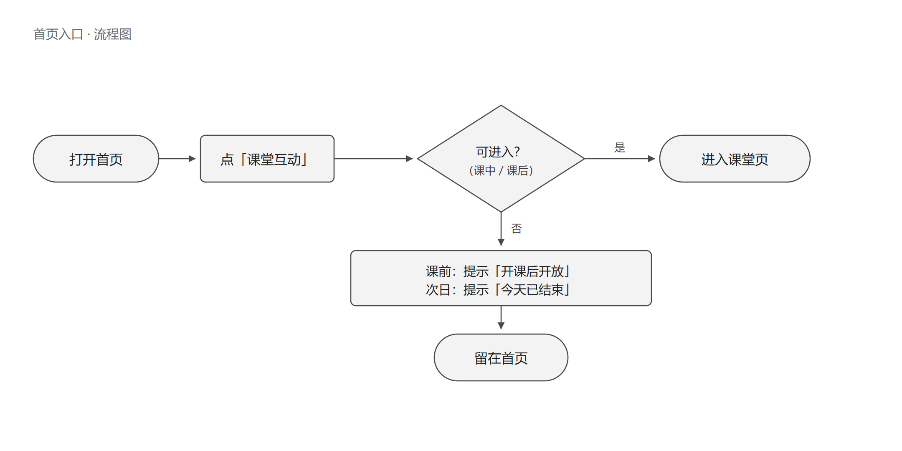 |
| 2 | **功能点名称**：课堂页（轮次列表） **功能描述**：学生进入课堂后的主页。顶部是本节课的状态条（课次与课节名、星星、得分排名）；主体是本节课的互动轮次列表，点任意一轮进入答题，答完整轮回到本页。 **主流程**：进入课堂 → 看到本节课全部轮次卡片（默认全部可点）→ 按老师口令点开某一轮 → 轮内答题 → 答完整轮回到本页 → 该轮卡片显示完成。 **规则**： • 顶部状态条：课次行「第一课 · 嗨！你好！」（原型图待更新）＋ 星星槽（个数＝本节课轮数，做完一轮亮一颗）＋ 🏆 得分排名（「等你上榜」／「12 / 40 · 5 分」）；口径见功能点 5； • 轮次卡片：一张卡 = 一轮互动（1~N 道题，题型可混）；卡面是序号、主题（中文 + 印尼语）、同班完成人数（x / 40）、右上角 ⚡（速度榜，见功能点 6）、右侧是播放图标 ▶；做完后序号变绿勾、右侧变重做图标 ↻；卡片上不出现星星与得分（都在顶部状态条）； • 轮次主题由老师在后台填写：不填则整行不显示；过长时卡片上省略号、后台可见全文； • 所有轮次默认开放，点卡片进该轮第 1 题（同时开始整轮计时，口径见功能点 6）；已完成的轮次再点 = 重做整轮（见功能点 4）；什么时候做哪一轮由老师口令控制，系统不做发放； • 卡片按阶梯错动排布：轮数多时左右错开（如 5 轮）； • 本节课全部轮次完成后，回到本页会出「全部完成」弹窗（全屏庆祝；视觉以 UI 稿为准）：只弹一次、只能点「Mantap!」关闭（点弹窗外不关）；关闭后停在全完成状态（全部绿勾、满星、总分）。 **原型图**： 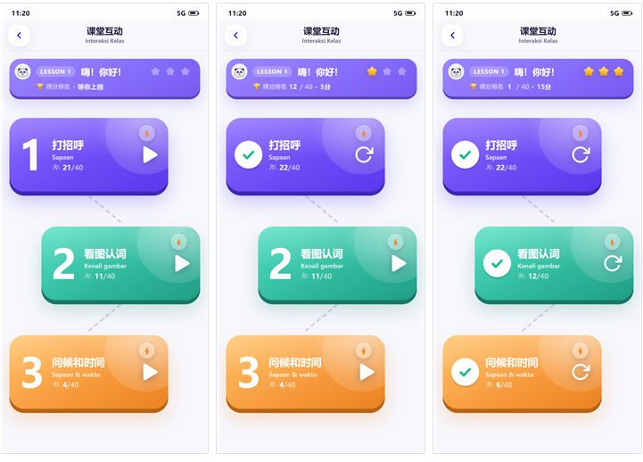 【课堂页 · 初始】｜【一轮已完成】｜【三轮已完成】  【全部完成弹窗】（关闭后停在三轮完成这一屏） **流程图**： 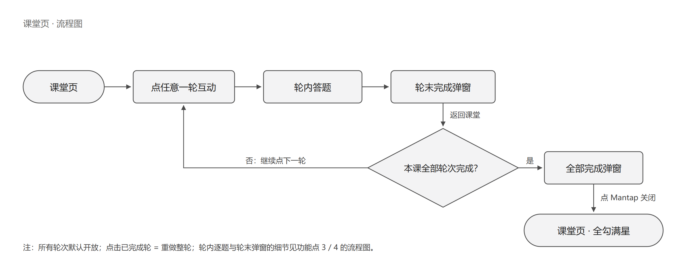 |
| 3 | **功能点名称**：轮内答题 **功能描述**：一轮互动内部的连续答题流程。学生逐题作答，每题做完后看到这道题的反馈（对 / 错，含正确答案；语音题只有一句鼓励）；非最后一题点「下一题」继续，答完最后一题进入整轮完成弹窗。一轮可包含 1~N 道题，题型可混。 **主流程**：进入该轮第 1 题 → 作答 → 提交 → 答题反馈 → 点「下一题」→ 第 2 题 → …… → 第 N 题 → 提交 → 整轮完成弹窗（功能点 4）。 **规则**： • 轮内连续答题、不返回课堂页，只有答完整轮才回课堂； • 非最后一题：提交后按钮变为「下一题（Lanjut）」，手动点击继续（不自动跳转）； • 最后一题：提交后按钮变为「已提交（Terkirim）」不可再点，短暂停顿后进入整轮完成弹窗； • 单题轮（一轮只有一道题）：提交后直接进入整轮完成弹窗，没有「下一题」环节； • 题目进度：多题轮显示「第 x / N 题」； • 判定类题型每题只判一次、不提供单题重做，想重做走整轮「再做一次」（功能点 4）； • 语音类题型（跟读模仿 / 看图说话 / 开放问答）：开口就算完成、不打分，口径见功能点 11； • 课堂投票：无对错，照常参与轮内流程，不影响本轮计分； • 中途退出不保存进度：下次进入从第 1 题重新开始，整轮重新计时。 **原型图**： 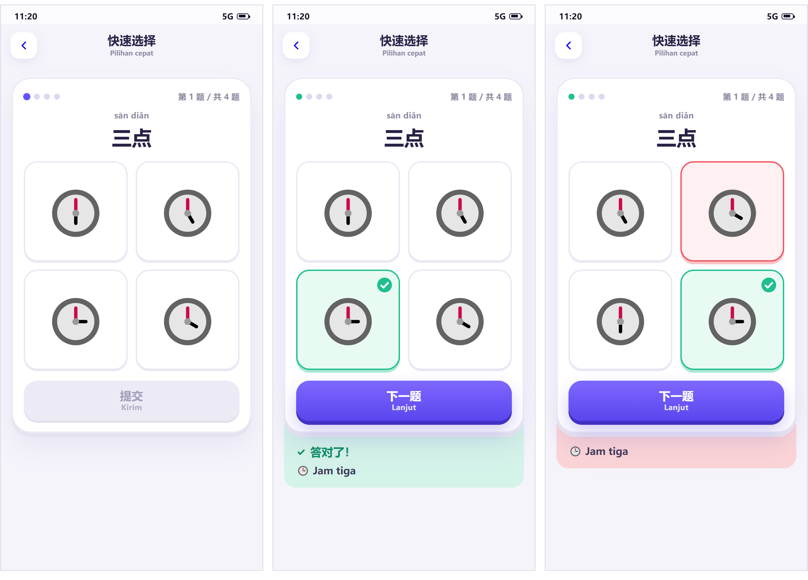 【轮内第 1 题】｜【答题反馈 · 正确】｜【答题反馈 · 错误】 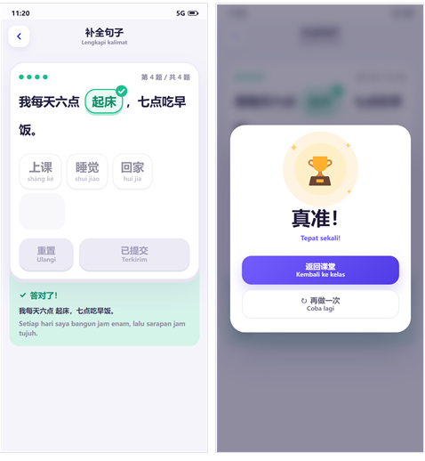 【最后一题 · 已提交】｜【整轮完成弹窗】 **流程图**： 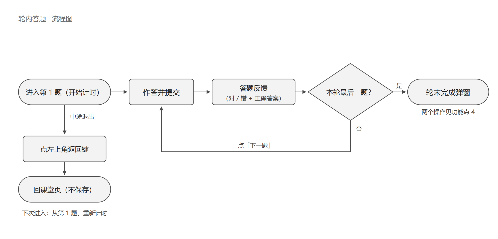 |
| 4 | **功能点名称**：整轮完成与「再做一次」 **功能描述**：一轮全部题目答完后出现的整轮完成弹窗：展示完成祝贺（表情 + 中文 + 印尼语），提供「返回课堂」「再做一次」两个操作；点弹窗外空白处可关闭弹窗、回看最后一题。 **主流程**：最后一题提交 → 答题反馈 → 整轮完成弹窗 →「返回课堂」（回轮次列表）｜「再做一次」（回第 1 题、整轮重做）｜点弹窗外空白处（关掉弹窗、回看最后一题）。 **规则**： • 弹窗内容：全屏遮罩 + 居中卡片；1 条祝贺语（表情徽章 + 中文标题 + 印尼语副题）；两个按钮（都带印尼语副行）：「返回课堂 / Kembali ke kelas」「再做一次 / Coba lagi」；不显示得分、星星、用时；视觉以 UI 稿为准； • 弹出时机：最后一题提交后，先照常显示本题的答题反馈，约 1 秒后弹窗才出现；弹窗以遮罩形式盖在题目页上层，本题反馈仍在（关掉弹窗即可看到）； • 祝贺语规则：按本轮有没有答错分两档（全对档 / 有答错档）；每次弹出时随机抽 1 条——同一句不连着重复，重做后再次完成时重新抽；候选清单见文末「附｜整轮完成弹窗 · 祝贺语候选清单」（全对 4 条 / 有答错 6 条）； • 按钮去向：「返回课堂」回课堂页轮次列表；「再做一次」回第 1 题、整轮重做（不是只重做最后一题）；重做后再次答完整轮仍会出弹窗（可继续重做、或返回课堂）；重做的计分与用时口径见功能点 5 / 6； • 关闭与回看：点弹窗外空白处可关闭弹窗；关掉后停在最后一题（已提交状态，可回看题目与对错），从那里点左上角返回键回课堂页； • 成绩记录：本轮成绩在最后一题提交后即已记录——无论点弹窗按钮还是点空白处关闭，都不影响；重做到一半退出不影响第一次的完成状态与成绩，下次进入该轮从第 1 题重新开始； • 「返回课堂」后该轮卡片显示完成（序号变绿勾、右侧变重做图标 ↻），仍可再次进入（重做整轮）。 **原型图**： 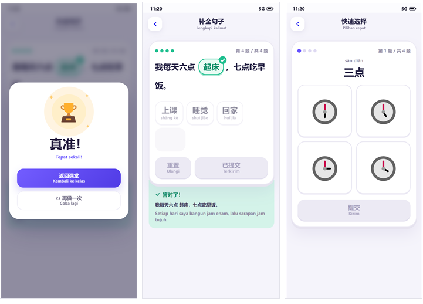 【整轮完成弹窗】｜【点掉弹窗后 · 回看最后一题】｜【再做一次 · 回到第 1 题】 **流程图**： 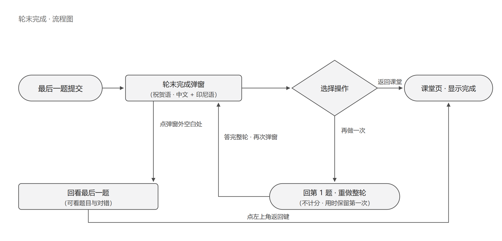 |
| 5 | **功能点名称**：计分与星星 **功能描述**：一轮完成后的结算，以及课堂页顶部状态条上的星星槽与得分排名。 **主流程**：完成一轮 → 结算（+5 分、+1 颗星）→ 回到课堂页，状态条更新星星与总分（名次随之刷新）。 **规则**： • 星星：一轮完成得 1 颗，重做不重复点亮； • 得分：一轮完成 +5 分，不看题数、不看对错（2026-09-24 定）；重做不重复计分；课堂总分 = 各轮求和（满分 = 轮数 × 5，如 3 轮满分 15 分）； • 名次：按课堂总分排名（同分并列）； • 课堂投票不影响计分：含投票的轮次照样 +5 分 + 1 颗星； • 整轮用时的口径与速度榜排名见功能点 6。 **原型图**： 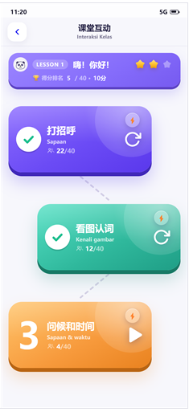 【课堂页 · 两轮完成（星星与名次行）】 **流程图**：—（纯规则、无分支，不单独画图） |
| 6 | **功能点名称**：速度榜 **功能描述**：按轮比完成速度的榜单，只比快慢、不看分数：每张轮次卡片右上角有一粒 ⚡，点开看这一轮谁最快。 **主流程**：完成一轮、系统记录用时 → 点卡片右上角 ⚡ → 弹层显示本轮排名（前 5 与我的行，三种状态见规则）→ 关闭。 **规则**： • 每轮一张榜（不是全班一张总榜），入口是卡片右上角的 ⚡； • 榜单内容：前 5 名（名次 + 名字 + 用时，如「1. Dewi 6 秒」）；分三种状态——① 我还没成绩：前 5 +「…」+ 灰色一行「你 · 还没上榜」；② 我在前 5：只列 5 行，我的行在名单里高亮、不重复单列；③ 我不在前 5：前 5 +「…」+ 单列我的行（高亮，含名次 + 用时）； • 关闭方式：右上角 ✕ / 点弹层外的灰色区域 / Esc； • 用时口径：整轮总用时（进入该轮第 1 题 → 最后一题提交）； • 只取第一次完成的用时：重做不覆盖、不计入。 **原型图**： 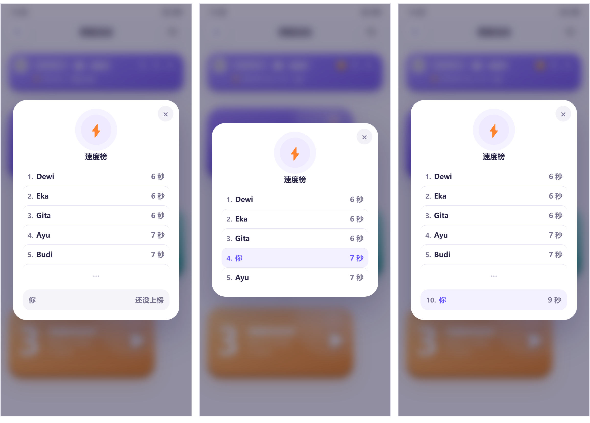 【还没有成绩 · 还没上榜】｜【我在前 5 · 名单里高亮】｜【不在前 5 · 单列我的行】 **流程图**： 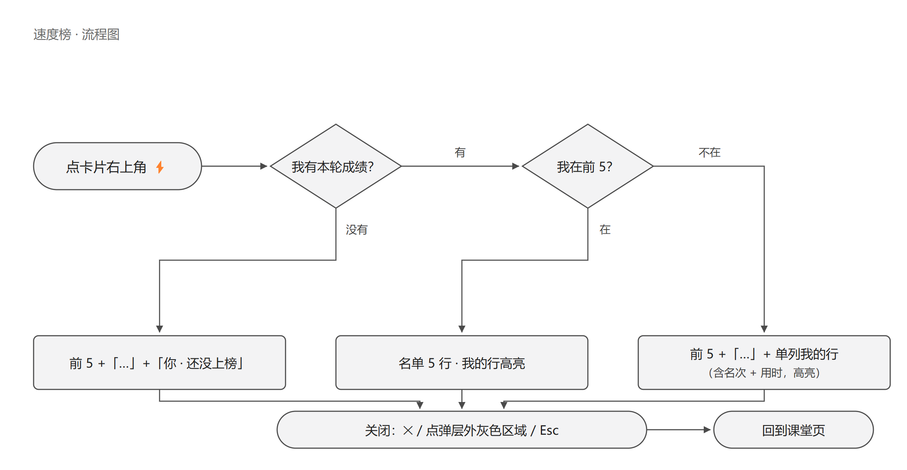 |
| 7 | **功能点名称**：作答方式 · 点选 **功能描述**：从选项里点一个、点「提交」才判分的作答方式；7 个题型共用这一套（快速选择、看图单选、听音选词、情景选择、对话补全、找错改错、课堂投票），各题型的区别只在「点的是什么」：快速选择有图片版与文字选项版两种载体（文字版样板见第 3 题：四行竖排、字母 A–D ＋ 汉字 ＋ 拼音）、看图单选点大图、听音选词先听再点词、找错改错点句子里的错词、情景选择点整句话、对话补全也是点整句话（提交后把选中的话填进对话气泡）。 **主流程**：看题干 → 点一个选项选中（紫描边）→ 可换选、可再点一下取消 → 点「提交」→ 判一次出结果（回执条滑出）→ 中间题按钮变「下一题」、最后一题变「已提交」。 **规则**： • 只在点「提交」时判分；提交前随便改，提交后不能改； • 答对：选中的选项变绿（带勾）+ 回执条给祝贺语和答案行；答错：选中的选项变红、正确项变绿，回执条只留答案行； • 每题只判一次、不给单题重试；想重练走整轮「再做一次」（功能点 4）； • 课堂投票不判对错：提交后中性反馈、照常算完成、不影响本轮计分（功能点 5）； • 轮内口径（下一题 / 已提交 / 记账与轮末弹窗）统一走功能点 3。 **原型图**： 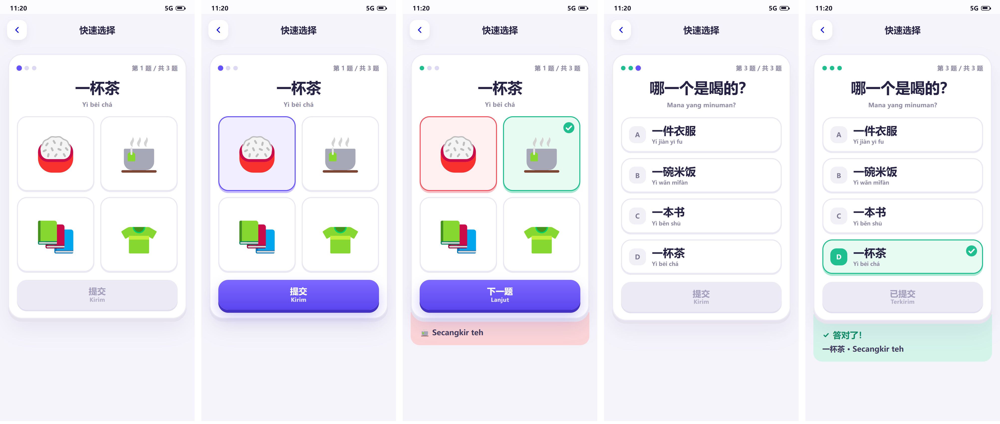 【待作答 · 图片版】｜【选中 · 图片版】｜【答错 · 图片版】｜【待作答 · 文字版（第 3 题）】｜【答对 · 文字版（第 3 题）】 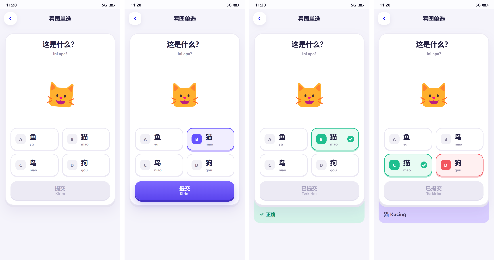 【待作答】｜【选中】｜【答对】｜【答错 · 正确项标绿】 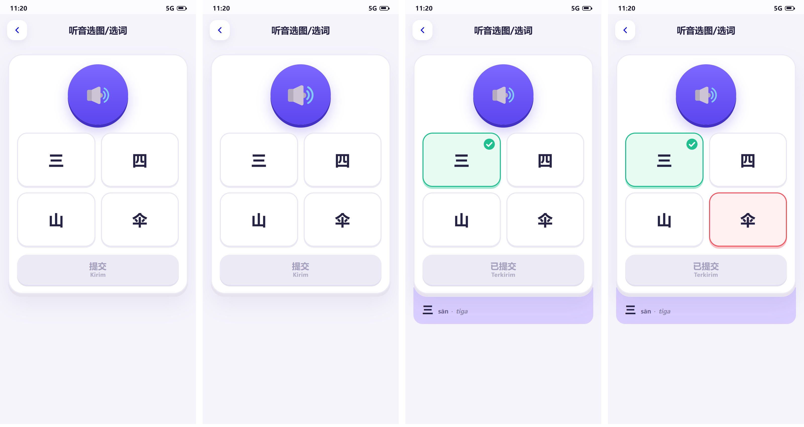 【待作答】｜【已点喇叭】｜【答对】｜【答错 · 正确项标绿】 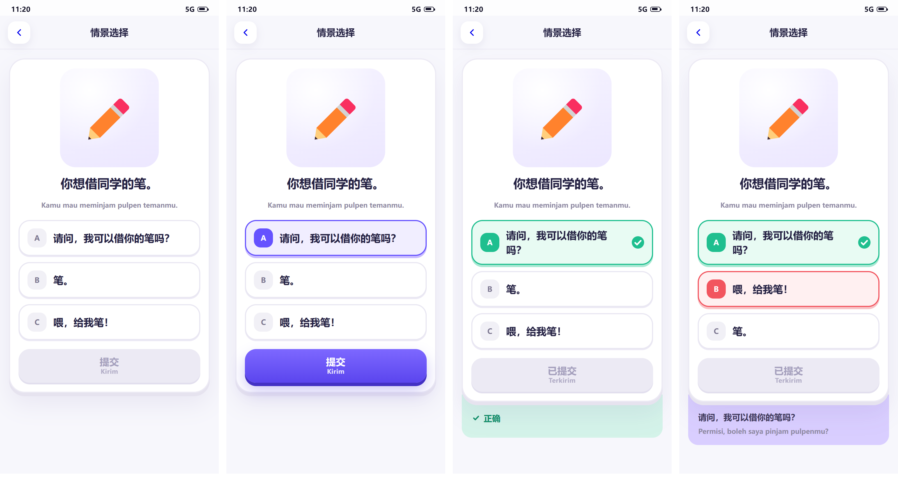 【待作答】｜【选中】｜【答对】｜【答错 · 正确项标绿】 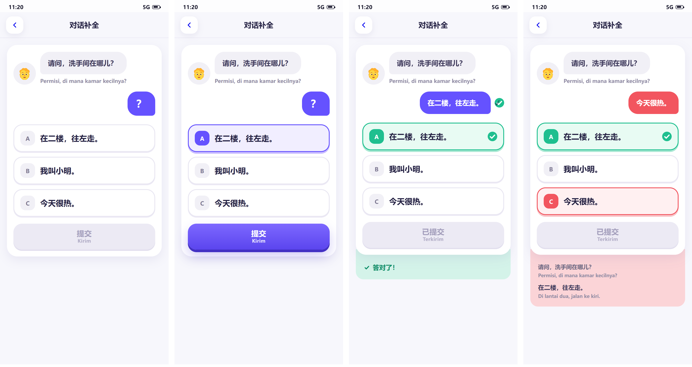 【待作答】｜【选中】｜【答对 · 答句进气泡】｜【答错 · 正确项标绿】 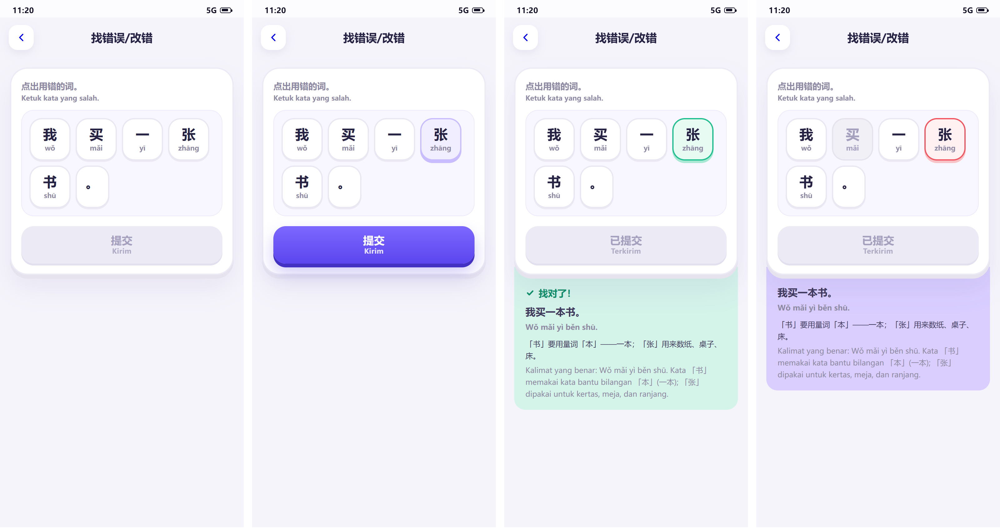 【待作答】｜【选中错词 · 改正中】｜【答对】｜【答错 · 正确项标绿】 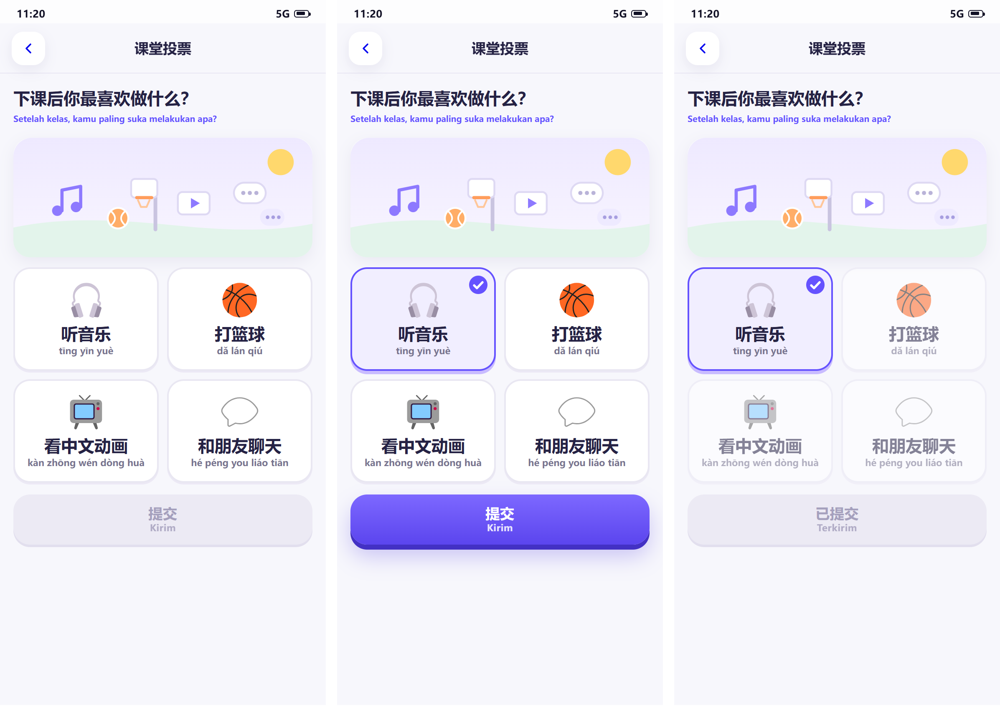 【待作答】｜【选中】｜【已提交 · 锁定 · 无对错】 **流程图**： 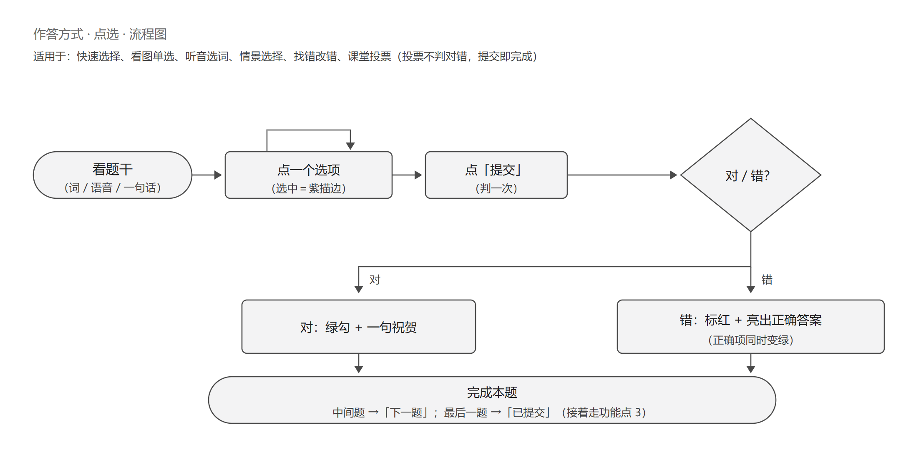 |
| 8 | **功能点名称**：作答方式 · 配对 **功能描述**：把配成对的两样各点一下、点了就判的作答方式；4 个题型共用这一套（连线配对、图片—词语连线、记忆翻牌、拼音—汉字—含义匹配），各题型的区别只在「点什么、怎么点」：连线配对左右各点一张、记忆翻牌连点两张、拼音匹配按「选汉字 → 选意思」两步走（逐组进行，一组配好约 0.9 秒自动进下一组）。 **主流程**：看题面（两组卡片）→ 点一张卡（紫描边）→ 点另一张 → 立刻判一次：对＝两边绿 + 勾 + 锁定；错＝两边红 + 抖动约 0.7 秒后复原 → 全部卡片配完 → 完成本题（没有「提交」键）。 **规则**： • 点了就判、边配边反馈；没有「提交」键，全部卡片配完才算完成本题； • 配对成功：两张卡变绿、打勾、锁定，不能再点；配对失败：两张卡变红 + 抖动约 0.7 秒后复原，原地重试，不显示正确答案； • 拼音匹配逐组进行：一组配好约 0.9 秒自动进入下一组； • 收尾后不能改：想重练走整轮「再做一次」（功能点 4）； • 轮内口径（下一题 / 已提交 / 记账与轮末弹窗）统一走功能点 3。 **原型图**： 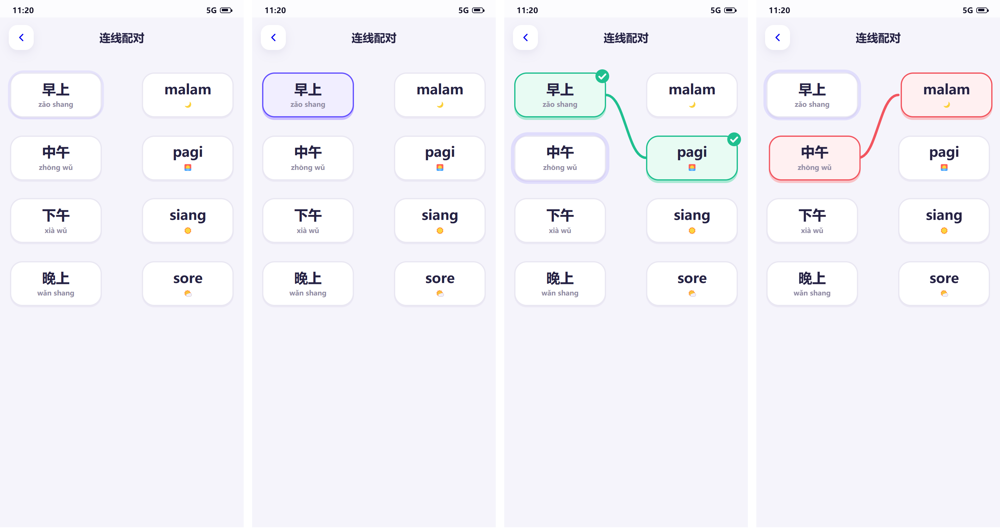 【待作答】｜【已点一张 · 紫】｜【配对成功 · 绿 + 勾】｜【配对失败 · 红 + 抖动】 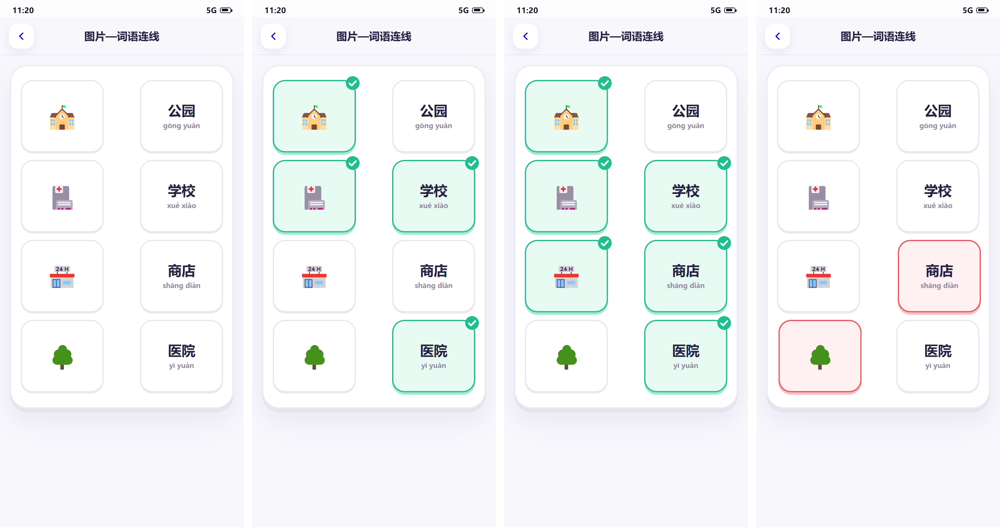 【待作答】｜【配对中】｜【配对成功】｜【配对失败】 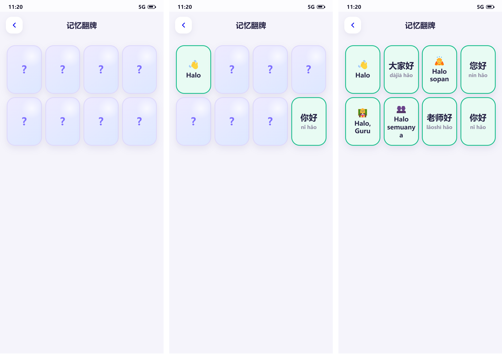 【开局】｜【翻开一对】｜【全部配完】 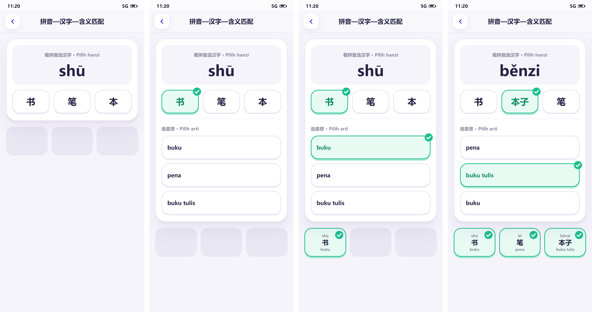 【待作答】｜【选中一项】｜【配好一组】｜【全部配好】 **流程图**： 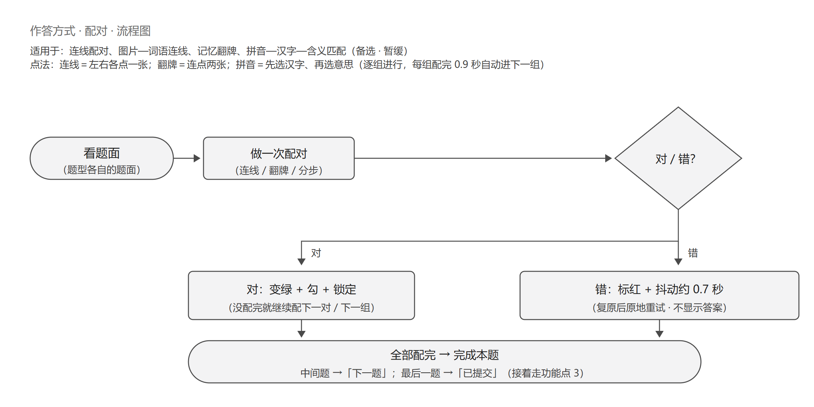 |
| 9 | **功能点名称**：作答方式 · 放块 **功能描述**：点词块放进空位、放好点「提交」判一次的作答方式；3 个题型共用这一套（补全句子、句子排序、拼字 / 组词），区别只在「放什么、放哪里」：补全句子往句子的空位里填空、句子排序把词块摆成正确顺序、拼字 / 组词把字块拼成词。 **主流程**：看题面（句子里有空位 + 下方词块）→ 点词块放进空位（点已填的可以拿回，「重置」一键清空）→ 全部空位填好 → 点「提交」→ 判一次出结果 → 中间题按钮变「下一题」、最后一题变「已提交」。 **规则**： • 只在点「提交」时判分；提交前随便换（点已填的拿回、重放、「重置」清空），提交后不能改； • 答对：填的块全部变绿（带勾）+ 回执条给「答对了」和完整句子； • 答错：填错的块变红、填对的变绿，回执条给完整正确句（中文 + 印尼语）； • 每题只判一次、不给单题重试；想重练走整轮「再做一次」（功能点 4）； • 轮内口径（下一题 / 已提交 / 记账与轮末弹窗）统一走功能点 3。 **原型图**： 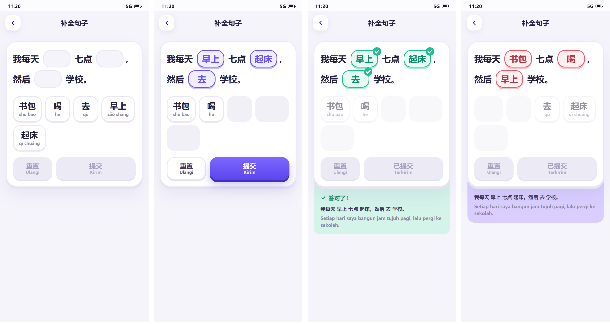 【待作答】｜【已填好 · 提交前】｜【答对 · 全绿 + 勾】｜【答错 · 错的红、对的正】 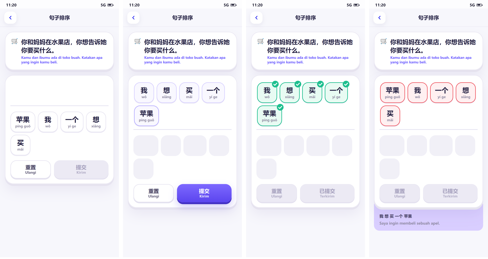 【待作答】｜【排好 · 提交前】｜【答对 · 全绿 + 勾】｜【答错 · 错的红、对的正】 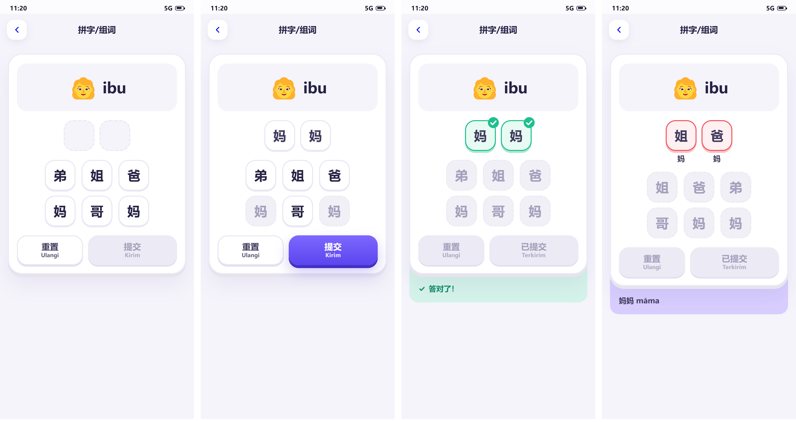 【待作答】｜【拼好 · 提交前】｜【答对 · 全绿 + 勾】｜【答错 · 错的红、对的正】 **流程图**： 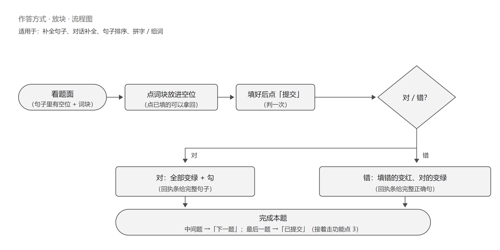 |
| 10 | **功能点名称**：作答方式 · 归类 **功能描述**：点一个词、点对应的类别框放进去，放好点「提交」判一次的作答方式（分类归组）。 **主流程**：看题面（待归类的词 + 类别框）→ 点一个词 → 点对应的类别框放进去（点框里的词可以拿回，「重置」清空）→ 全部词放好 → 点「提交」→ 判一次出结果 → 中间题按钮变「下一题」、最后一题变「已提交」。 **规则**： • 只在点「提交」时判分；提交前随便换（拿回、重放、「重置」清空），提交后不能改； • 答对：词留在框里变绿 + 回执条给祝贺语； • 答错：放错的词退回待归类区并标红，同时标出它该去的类别（如「→ 吃 · makan」），回执条给鼓励语「再想想」； • 每题只判一次、不给单题重试；想重练走整轮「再做一次」（功能点 4）； • 轮内口径（下一题 / 已提交 / 记账与轮末弹窗）统一走功能点 3。 **原型图**： 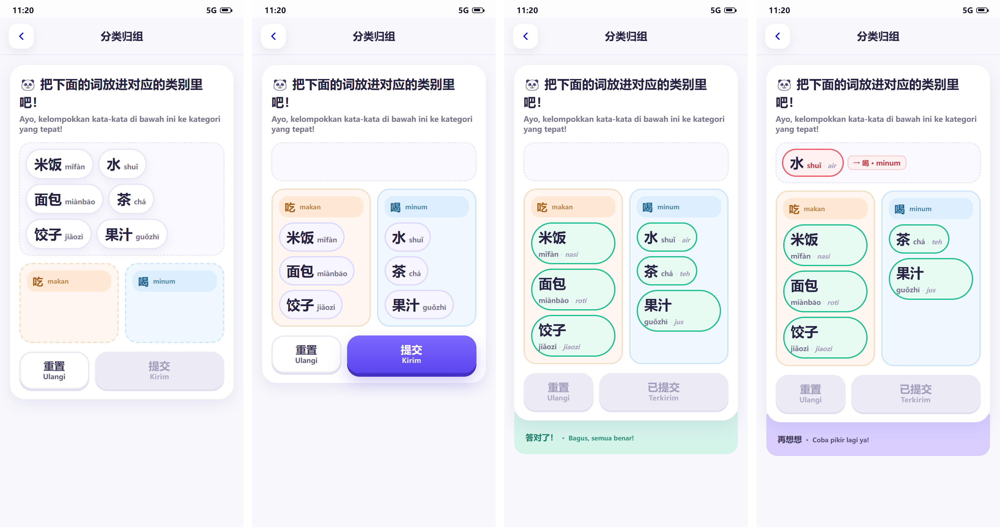 【待作答】｜【已放好 · 提交前】｜【答对 · 全绿 + 勾】｜【答错 · 错词退回标红】 **流程图**： 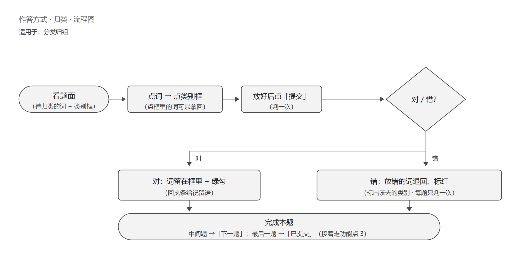 |
| 11 | **功能点名称**：作答方式 · 录音 **功能描述**：按住麦克风读完 / 说完、松手出结果的作答方式；3 个语音题型共用（跟读模仿、看图说话、开放问答）——不判对错、不打分，开口就算完成，反馈只有一句鼓励；跟读模仿页另有「听范读」喇叭，可反复听。 **主流程**：看题面（跟读页可先听范读）→ 按住麦克风读完（或点一下开始、再点一下停）→ 松手 → 识别中约 1 秒 → 回执条滑出给一句鼓励 → 中间题按钮变「下一题」、最后一题变「已提交」。 **规则**： • 手势：按住读完松手结束；也可以点一下开始、再点一下结束，两条路等效； • 出结果＝完成：不判对错、不打分，反馈只有一句鼓励（中文 + 印尼语），只夸「开口说了」； • 重录：轮内做完一次后麦克风按钮停用（变灰、点不动），想重练走整轮「再做一次」（功能点 4）； • 跟读模仿的练习卡带参考读音（字 + 拼音）和「听范读」喇叭；看图说话 / 开放问答没有范读； • 录音题照常算这题完成：中间题「下一题」、最后一题「已提交」，轮末弹窗与计分走功能点 3 / 4 / 5。 **原型图**： 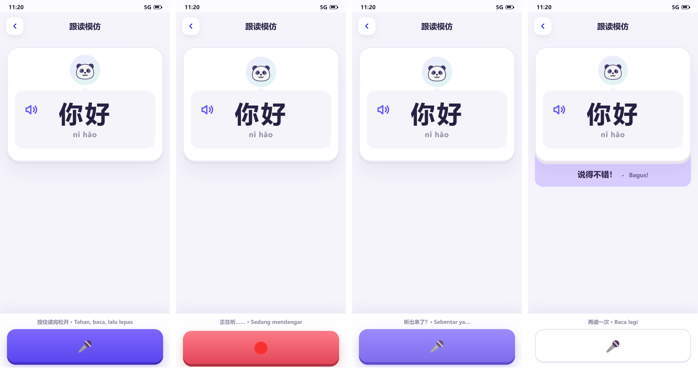 【待录音】｜【录音中 · 正在听】｜【识别中】｜【结果 · 一句鼓励】 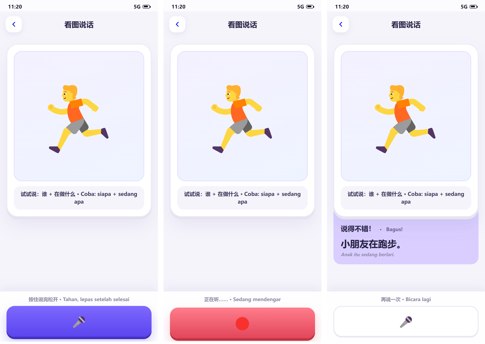 【待说】｜【录音中 · 正在听】｜【结果 · 学习卡】 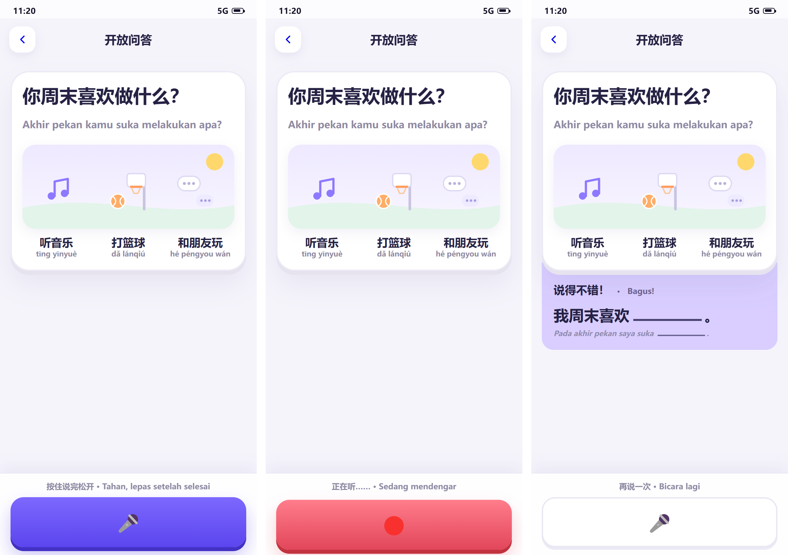 【待答】｜【录音中 · 正在听】｜【结果 · 学习卡】 **流程图**： 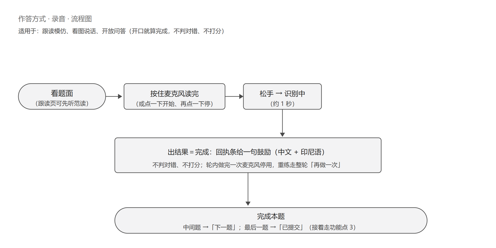 |

---

## 附｜作答方式（5 类）

> 用途：18 个题型看着多，底层只有 5 类；研发按这 5 类做通用的作答与判定，各题型页主要是换内容、换样式。每一类的完整口径见功能点 7–11（本表为速查索引）；逐题细节以对应页面为准。

| 作答方式 | 学生怎么作答 | 怎么算完成 · 怎么判 | 包含题型 |
|---|---|---|---|
| **点选** | 从选项里点一个（选项可能是图片、词或句子），选好点「提交」 | 提交后判一次并算完成：对＝绿勾，错＝红色＋显示正确答案；提交前可改选；每题只判一次、不给单题重试（想重练走整轮「再做一次」）；课堂投票不判对错，提交也算完成 | 快速选择、看图单选、听音选词、情景选择、对话补全、找错改错、课堂投票 |
| **配对** | 把配成对的两样各点一下：连线题左右各点一个；翻牌题连点两张；拼音匹配按「选汉字 → 选意思」一步步点 | 配完最后一对算完成；点了就判、边配边反馈：配对成功两边变绿打勾并锁定；配错原地重试、不显示正确答案 | 连线配对、图片—词语连线、记忆翻牌、拼音—汉字—含义匹配 |
| **放块** | 点下面的词块，把它放进句子空位 / 按顺序摆好 / 拼成词，放好点「提交」 | 提交后判一次并算完成：对＝绿勾，错＝红色＋显示正确答案；每题只判一次、不给单题重试 | 补全句子、句子排序、拼字 / 组词 |
| **归类** | 点一个词 → 点对应的类别框，词就放进去了；点框里的词可以拿回来；放好点「提交」 | 提交后判一次并算完成：对＝绿勾，错＝红色＋显示正确答案；每题只判一次、不给单题重试 | 分类归组 |
| **录音** | 按住麦克风读完 / 说完，松手结束；也可以点一下开始、再点一下结束 | 松手出结果就算完成；不判对错、不打分，反馈只有一句鼓励；轮内做完一次就锁定重录（想重练走整轮「再做一次」） | 跟读模仿、看图说话、开放问答 |

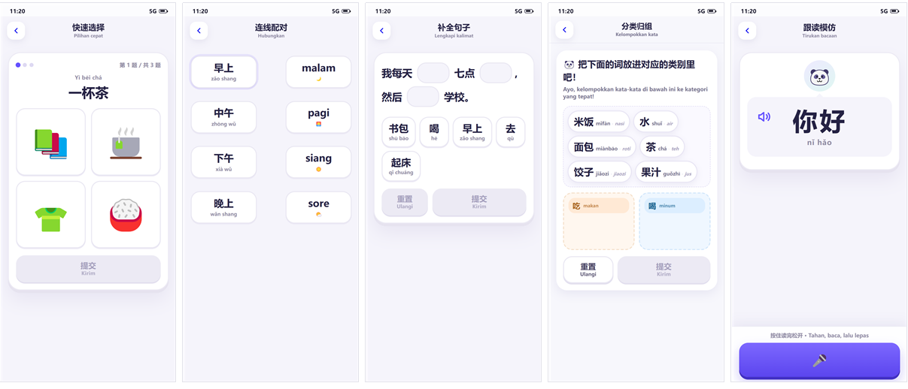
【点选】｜【配对】｜【放块】｜【归类】｜【录音】

---

## 附｜题型清单（18 种）

> 用途：研发 / UI 索引；「作答方式」一列对应功能点 7–11 的 5 类；各题型的细节口径仍以对应页面为准。

| # | 题型 | 页面 | 作答方式 | 备注 |
|---|---|---|---|---|
| 1 | 快速选择 | interaction-choice.html | 点选 | 图片版 / 文字选项版两种载体（文字版样板：第 3 题） |
| 2 | 看图单选 | interaction-picture.html | 点选 | |
| 3 | 连线配对 | match.html | 配对 | |
| 4 | 听音选词 | interaction-listening.html | 点选 | |
| 5 | 补全句子 | interaction-fill.html | 放块 | |
| 6 | 句子排序 | interaction-order.html | 放块 | |
| 7 | 课堂投票 | interaction-poll.html | 点选 | 无对错；照常参与轮内流程 |
| 8 | 记忆翻牌 | memory.html | 配对 | |
| 9 | 图片—词语连线 | interaction-picture-match.html | 配对 | |
| 10 | 情景选择 | interaction-situation.html | 点选 | |
| 11 | 对话补全 | interaction-dialogue.html | 点选 | 选项是整句话；提交后填进对话气泡 |
| 12 | 拼音—汉字—含义匹配 | interaction-pinyin-match.html | 配对 | |
| 13 | 分类归组 | interaction-category.html | 归类 | |
| 14 | 拼字 / 组词 | interaction-word-build.html | 放块 | |
| 15 | 找错改错 | interaction-correction.html | 点选 | |
| 16 | 跟读模仿 | interaction-read-aloud.html | 录音 | 语音题；开口就算完成、不打分 |
| 17 | 看图说话 | interaction-picture-talk.html | 录音 | 语音题；开口就算完成、不打分 |
| 18 | 开放问答 | interaction-open-qa.html | 录音 | 语音题；开口就算完成、不打分 |

---

## 附｜给后台的字段要求

> 用途：给后台 / 研发核对「互动轮次」这一层需要的配置字段；所有轮次默认开放，不需要老师发放 / 解锁开关（2026-09-24 定）。

| 字段 | 说明 |
|---|---|
| 轮次 ID | 每轮唯一，用于完成状态与成绩记录 |
| 轮次顺序 | 决定课堂页卡片顺序，也是卡片上 1 / 2 / 3 序号的来源 |
| 轮次主题 | 中文 + 印尼语，老师在后台填写（规则见功能点 2） |
| 题目列表 | 一轮包含哪些题、题目顺序；题型可混 |
| 题目内容 | 每道题的题型与题目数据（复用平台现有题型配置） |
| 轮次完成状态 | 学生侧记录：未完成 / 已完成 |
| 轮次汇总得分 | 完成一轮固定 +5 分、+1 颗星（作为该轮展示与全班汇总的口径） |

---

## 附｜整轮完成弹窗 · 祝贺语候选清单

> 用途：功能点 4 弹窗的祝贺语来源。「全对」＝本次作答一道都没答错；「有答错」＝本次作答中答错过任意一题。每次弹窗出现时，从对应档位随机抽 1 条；同一句不连着重复；重做后再次完成时重新抽。

| 档位 | 表情 | 中文 | 印尼语 |
|---|---|---|---|
| 全对 | 🏆 | 一次就对！ | Sekali coba, benar! |
| 全对 | 🏆 | 一下就答对！ | Langsung benar! |
| 全对 | 🏆 | 真准！ | Tepat sekali! |
| 全对 | 🏆 | 一眼就对！ | Sekali lihat, tepat! |
| 有答错 | 🤩 | 太棒了！ | Hebat! |
| 有答错 | 💥 | 无敌了！ | Luar biasa! |
| 有答错 | 👍 | 做得好！ | Kerja bagus! |
| 有答错 | ✨ | 漂亮！ | Mantap! |
| 有答错 | 🔥 | 就是这样！ | Itu dia! |
| 有答错 | 😎 | 太酷了！ | Keren! |
